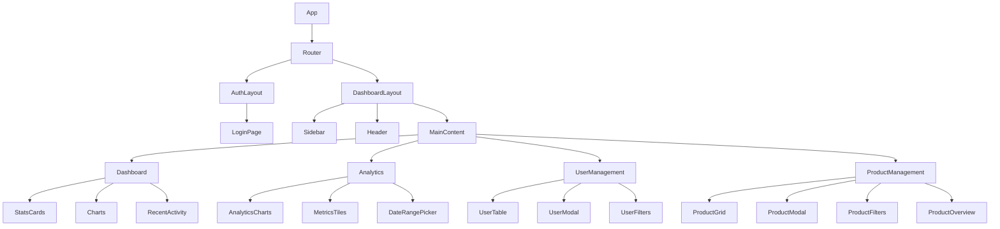

# Administrator Dashboard Design Document

## Overview

A comprehensive administrator dashboard built with React, Vite, and Tailwind CSS 4, featuring a clean, minimalistic design with enterprise-level functionality. The dashboard provides administrators with powerful tools for user management, analytics monitoring, and product management in an intuitive interface.

### Key Features
- **Authentication System**: Secure login with role-based access
- **Analytics Dashboard**: Real-time data visualization and insights
- **User Management**: Complete CRUD operations for user accounts
- **Product Management**: Full product lifecycle management
- **Enterprise Theme**: Professional, clean, and minimalistic design
- **Responsive Design**: Optimized for all device sizes

## Technology Stack & Dependencies

### Core Technologies
- **Frontend Framework**: React 18+
- **Build Tool**: Vite
- **Styling**: Tailwind CSS 4
- **TypeScript**: For type safety and better development experience

### Additional Dependencies
```json
{
  "dependencies": {
    "react": "^18.2.0",
    "react-dom": "^18.2.0",
    "react-router-dom": "^6.8.0",
    "@tanstack/react-query": "^4.24.0",
    "zustand": "^4.3.0",
    "react-hook-form": "^7.43.0",
    "zod": "^3.20.0",
    "recharts": "^2.5.0",
    "lucide-react": "^0.314.0",
    "date-fns": "^2.29.0",
    "react-hot-toast": "^2.4.0"
  },
  "devDependencies": {
    "@types/react": "^18.0.0",
    "@types/react-dom": "^18.0.0",
    "@vitejs/plugin-react": "^3.1.0",
    "typescript": "^4.9.0",
    "tailwindcss": "^4.0.0",
    "autoprefixer": "^10.4.0",
    "postcss": "^8.4.0"
  }
}
```

## Component Architecture

### Component Hierarchy



### Core Components Definition

#### Layout Components

**AuthLayout**
- Purpose: Wrapper for authentication pages
- Props: `children: ReactNode`
- Features: Centered layout, brand logo, responsive design

**DashboardLayout**
- Purpose: Main application layout with sidebar and header
- Props: `children: ReactNode`
- Features: Collapsible sidebar, user profile dropdown, breadcrumbs

**Sidebar**
- Purpose: Navigation menu for dashboard sections
- State: `isCollapsed: boolean`, `activeRoute: string`
- Features: Icon-based navigation, tooltips on hover, active state indicators

**Header**
- Purpose: Top navigation bar with user controls
- Features: Search bar, notifications, user avatar, theme toggle

#### Page Components

**LoginPage**
- Purpose: User authentication interface
- Form Fields: `email`, `password`
- Features: Form validation, loading states, error handling
- Validation: Email format, minimum password length

**Dashboard**
- Purpose: Overview of key metrics and activities
- Components: `StatsCards`, `Charts`, `RecentActivity`
- Data: User count, revenue, orders, active sessions

**Analytics**
- Purpose: Detailed analytics and reporting
- Components: `AnalyticsCharts`, `MetricsTiles`, `DateRangePicker`
- Features: Time range selection, export functionality, drill-down capabilities

**UserManagement**
- Purpose: User account administration
- Components: `UserTable`, `UserModal`, `UserFilters`
- Features: CRUD operations, role assignment, status management

**ProductManagement**
- Purpose: Product catalog administration
- Components: `ProductGrid`, `ProductModal`, `ProductFilters`, `ProductOverview`
- Features: Product CRUD, inventory tracking, category management

### Props/State Management

#### Component Props Interface

```typescript
// User Management
interface User {
  id: string;
  name: string;
  email: string;
  role: 'admin' | 'user' | 'moderator';
  status: 'active' | 'inactive' | 'suspended';
  createdAt: Date;
  lastLogin?: Date;
}

// Product Management
interface Product {
  id: string;
  name: string;
  description: string;
  price: number;
  category: string;
  stock: number;
  status: 'active' | 'inactive' | 'draft';
  images: string[];
  createdAt: Date;
  updatedAt: Date;
}

// Analytics
interface AnalyticsData {
  period: string;
  users: number;
  revenue: number;
  orders: number;
  conversionRate: number;
}
```

### Lifecycle Methods/Hooks

#### Custom Hooks

**useAuth**
- Purpose: Authentication state management
- Returns: `{ user, login, logout, isLoading, isAuthenticated }`
- Features: Token management, role-based access control

**useUsers**
- Purpose: User data management
- Returns: `{ users, createUser, updateUser, deleteUser, isLoading }`
- Features: Optimistic updates, caching, pagination

**useProducts**
- Purpose: Product data management
- Returns: `{ products, createProduct, updateProduct, deleteProduct, isLoading }`
- Features: Image upload, inventory tracking, search functionality

**useAnalytics**
- Purpose: Analytics data fetching
- Returns: `{ data, isLoading, refetch, dateRange, setDateRange }`
- Features: Real-time updates, date range filtering

## Routing & Navigation

### Route Structure

```typescript
const routes = [
  {
    path: '/login',
    element: <AuthLayout><LoginPage /></AuthLayout>,
    public: true
  },
  {
    path: '/',
    element: <DashboardLayout />,
    children: [
      {
        index: true,
        element: <Dashboard />
      },
      {
        path: 'analytics',
        element: <Analytics />
      },
      {
        path: 'users',
        element: <UserManagement />
      },
      {
        path: 'products',
        element: <ProductManagement />,
        children: [
          {
            index: true,
            element: <ProductOverview />
          },
          {
            path: 'add',
            element: <ProductForm />
          },
          {
            path: 'edit/:id',
            element: <ProductForm />
          }
        ]
      }
    ]
  }
];
```

### Navigation Menu Items

```typescript
const navigationItems = [
  {
    name: 'Dashboard',
    href: '/',
    icon: 'LayoutDashboard',
    description: 'Overview and key metrics'
  },
  {
    name: 'Analytics',
    href: '/analytics',
    icon: 'BarChart3',
    description: 'Detailed reports and insights'
  },
  {
    name: 'Users',
    href: '/users',
    icon: 'Users',
    description: 'User account management'
  },
  {
    name: 'Products',
    href: '/products',
    icon: 'Package',
    description: 'Product catalog management',
    children: [
      {
        name: 'Overview',
        href: '/products',
        description: 'Product overview and statistics'
      },
      {
        name: 'Add Product',
        href: '/products/add',
        description: 'Create new product'
      }
    ]
  }
];
```

## Styling Strategy

### Tailwind CSS 4 Configuration

```javascript
// tailwind.config.js
module.exports = {
  content: ['./src/**/*.{js,ts,jsx,tsx}'],
  theme: {
    extend: {
      colors: {
        primary: {
          50: '#f0f9ff',
          500: '#3b82f6',
          600: '#2563eb',
          700: '#1d4ed8',
          900: '#1e3a8a'
        },
        gray: {
          50: '#f9fafb',
          100: '#f3f4f6',
          800: '#1f2937',
          900: '#111827'
        }
      },
      fontFamily: {
        sans: ['Inter', 'system-ui', 'sans-serif']
      },
      boxShadow: {
        'soft': '0 2px 15px -3px rgba(0, 0, 0, 0.07), 0 10px 20px -2px rgba(0, 0, 0, 0.04)'
      }
    }
  },
  plugins: [
    require('@tailwindcss/forms'),
    require('@tailwindcss/typography')
  ]
};
```

### Design System

#### Enterprise Theme Specifications

**Color Palette**
- Primary: Blue (#3b82f6) - Professional and trustworthy
- Secondary: Gray (#6b7280) - Neutral and balanced
- Success: Green (#10b981) - Positive actions
- Warning: Amber (#f59e0b) - Caution states
- Error: Red (#ef4444) - Error states
- Background: White/Gray-50 - Clean and minimal

**Typography Scale**
- Headings: Inter font family, bold weights
- Body: Inter font family, regular weights
- Code: JetBrains Mono, monospace

**Spacing System**
- Base unit: 4px (0.25rem)
- Component padding: 16px (1rem)
- Section margins: 24px (1.5rem)
- Page margins: 32px (2rem)

**Component Styling Standards**

```css
/* Button Variants */
.btn-primary {
  @apply bg-primary-600 hover:bg-primary-700 text-white px-4 py-2 rounded-lg font-medium transition-colors;
}

.btn-secondary {
  @apply bg-gray-100 hover:bg-gray-200 text-gray-900 px-4 py-2 rounded-lg font-medium transition-colors;
}

/* Card Component */
.card {
  @apply bg-white rounded-xl shadow-soft border border-gray-100 p-6;
}

/* Table Styling */
.table {
  @apply w-full border-collapse;
}

.table th {
  @apply bg-gray-50 px-6 py-3 text-left text-xs font-medium text-gray-500 uppercase tracking-wider;
}

.table td {
  @apply px-6 py-4 whitespace-nowrap text-sm text-gray-900 border-b border-gray-200;
}
```

## State Management

### Zustand Store Structure

```typescript
// Auth Store
interface AuthStore {
  user: User | null;
  isAuthenticated: boolean;
  isLoading: boolean;
  login: (credentials: LoginCredentials) => Promise<void>;
  logout: () => void;
  checkAuth: () => Promise<void>;
}

// UI Store
interface UIStore {
  sidebarCollapsed: boolean;
  theme: 'light' | 'dark';
  toggleSidebar: () => void;
  setTheme: (theme: 'light' | 'dark') => void;
}

// Data Stores
interface UserStore {
  users: User[];
  selectedUser: User | null;
  filters: UserFilters;
  pagination: Pagination;
  actions: {
    fetchUsers: () => Promise<void>;
    createUser: (user: CreateUserData) => Promise<void>;
    updateUser: (id: string, user: UpdateUserData) => Promise<void>;
    deleteUser: (id: string) => Promise<void>;
    setFilters: (filters: UserFilters) => void;
  };
}
```

### State Management Patterns

**Optimistic Updates**
- Immediate UI updates for better UX
- Rollback on failure with error notifications
- Loading states for async operations

**Caching Strategy**
- React Query for server state management
- 5-minute cache time for static data
- Real-time updates for critical metrics

## API Integration Layer

### API Service Architecture

```typescript
// Base API Client
class ApiClient {
  private baseURL: string;
  private token: string | null;

  constructor(baseURL: string) {
    this.baseURL = baseURL;
    this.token = localStorage.getItem('auth_token');
  }

  async request<T>(endpoint: string, options: RequestOptions): Promise<T> {
    // Implementation with error handling, retry logic, and interceptors
  }
}

// Service Classes
class UserService {
  async getUsers(filters?: UserFilters): Promise<PaginatedResponse<User>> {
    return this.apiClient.request('/api/users', { method: 'GET', params: filters });
  }

  async createUser(userData: CreateUserData): Promise<User> {
    return this.apiClient.request('/api/users', { method: 'POST', body: userData });
  }

  async updateUser(id: string, userData: UpdateUserData): Promise<User> {
    return this.apiClient.request(`/api/users/${id}`, { method: 'PUT', body: userData });
  }

  async deleteUser(id: string): Promise<void> {
    return this.apiClient.request(`/api/users/${id}`, { method: 'DELETE' });
  }
}
```

### API Endpoints Reference

**Authentication**
- `POST /api/auth/login` - User login
- `POST /api/auth/logout` - User logout
- `GET /api/auth/me` - Get current user

**User Management**
- `GET /api/users` - List users with pagination
- `POST /api/users` - Create new user
- `PUT /api/users/:id` - Update user
- `DELETE /api/users/:id` - Delete user
- `PATCH /api/users/:id/status` - Update user status

**Product Management**
- `GET /api/products` - List products with filtering
- `POST /api/products` - Create new product
- `PUT /api/products/:id` - Update product
- `DELETE /api/products/:id` - Delete product
- `POST /api/products/:id/images` - Upload product images

**Analytics**
- `GET /api/analytics/dashboard` - Dashboard metrics
- `GET /api/analytics/users` - User analytics
- `GET /api/analytics/revenue` - Revenue analytics
- `GET /api/analytics/export` - Export analytics data

## Testing Strategy

### Unit Testing

**Testing Framework**: Jest + React Testing Library

**Component Testing Approach**
```typescript
// Example: LoginPage.test.tsx
import { render, screen, fireEvent, waitFor } from '@testing-library/react';
import { LoginPage } from './LoginPage';

describe('LoginPage', () => {
  it('should validate email format', async () => {
    render(<LoginPage />);
    
    const emailInput = screen.getByLabelText(/email/i);
    fireEvent.change(emailInput, { target: { value: 'invalid-email' } });
    fireEvent.blur(emailInput);
    
    await waitFor(() => {
      expect(screen.getByText(/invalid email format/i)).toBeInTheDocument();
    });
  });

  it('should submit form with valid credentials', async () => {
    const mockLogin = jest.fn();
    render(<LoginPage onLogin={mockLogin} />);
    
    fireEvent.change(screen.getByLabelText(/email/i), {
      target: { value: 'admin@example.com' }
    });
    fireEvent.change(screen.getByLabelText(/password/i), {
      target: { value: 'password123' }
    });
    fireEvent.click(screen.getByRole('button', { name: /sign in/i }));
    
    await waitFor(() => {
      expect(mockLogin).toHaveBeenCalledWith({
        email: 'admin@example.com',
        password: 'password123'
      });
    });
  });
});
```

**Custom Hook Testing**
```typescript
// Example: useAuth.test.ts
import { renderHook, act } from '@testing-library/react';
import { useAuth } from './useAuth';

describe('useAuth', () => {
  it('should handle login flow', async () => {
    const { result } = renderHook(() => useAuth());
    
    await act(async () => {
      await result.current.login({
        email: 'admin@example.com',
        password: 'password123'
      });
    });
    
    expect(result.current.isAuthenticated).toBe(true);
    expect(result.current.user).toBeDefined();
  });
});
```

### Integration Testing

**End-to-End Testing**: Cypress

```typescript
// cypress/e2e/admin-dashboard.cy.ts
describe('Admin Dashboard', () => {
  beforeEach(() => {
    cy.login('admin@example.com', 'password123');
  });

  it('should navigate through dashboard sections', () => {
    cy.visit('/');
    
    // Test navigation
    cy.get('[data-testid="sidebar"]').should('be.visible');
    cy.get('[data-testid="nav-analytics"]').click();
    cy.url().should('include', '/analytics');
    
    // Test analytics page
    cy.get('[data-testid="analytics-charts"]').should('be.visible');
    cy.get('[data-testid="date-range-picker"]').should('be.visible');
  });

  it('should manage users', () => {
    cy.visit('/users');
    
    // Test user creation
    cy.get('[data-testid="add-user-btn"]').click();
    cy.get('[data-testid="user-modal"]').should('be.visible');
    
    cy.get('input[name="name"]').type('John Doe');
    cy.get('input[name="email"]').type('john@example.com');
    cy.get('select[name="role"]').select('user');
    
    cy.get('[data-testid="save-user-btn"]').click();
    cy.get('[data-testid="user-table"]').should('contain', 'John Doe');
  });
});
```

### Testing Coverage Goals
- **Components**: 90%+ coverage for UI components
- **Hooks**: 95%+ coverage for custom hooks
- **Utils**: 100% coverage for utility functions
- **Integration**: Critical user flows covered

### Performance Testing
- **Lighthouse CI**: Performance, accessibility, and SEO audits
- **Bundle Analysis**: Code splitting and chunk optimization
- **Load Testing**: API endpoint performance under load