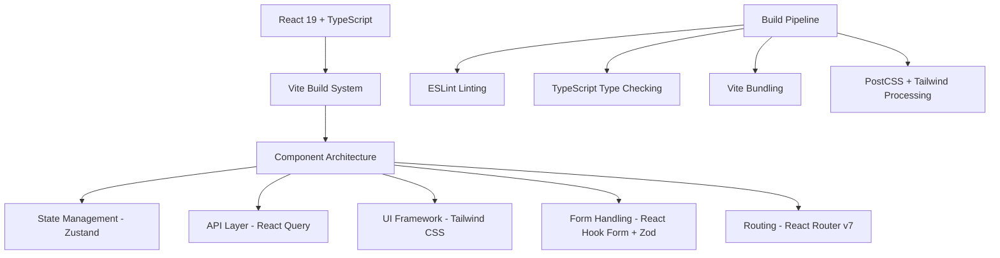
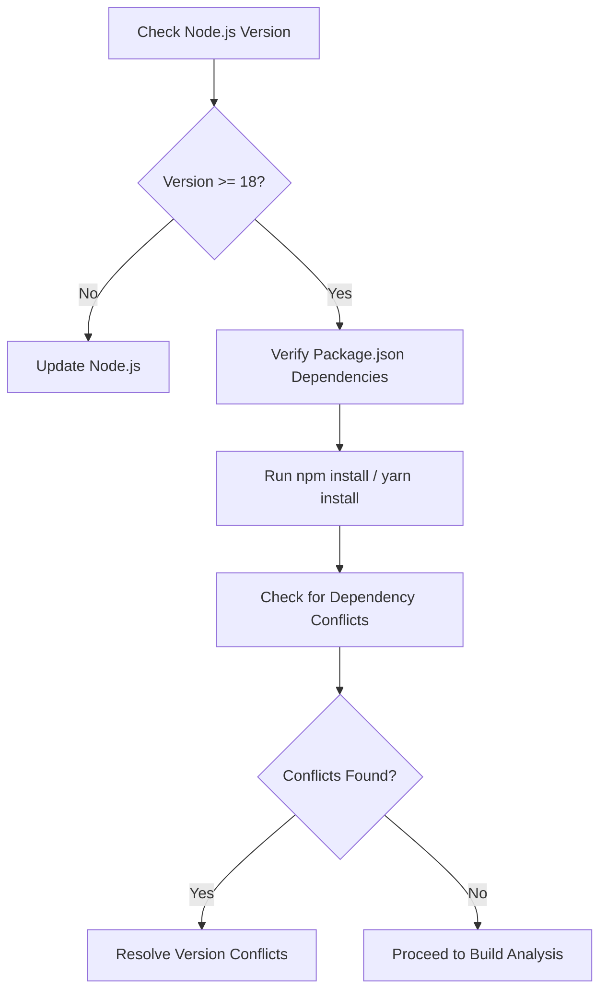
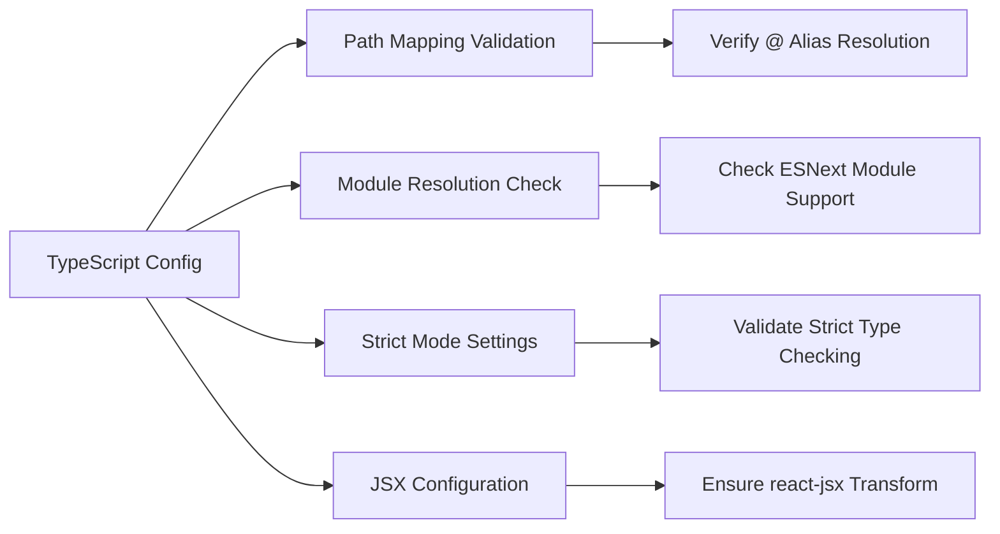
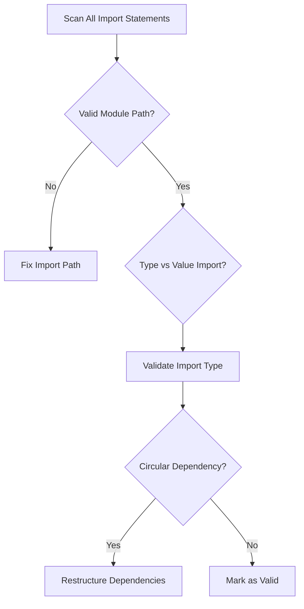
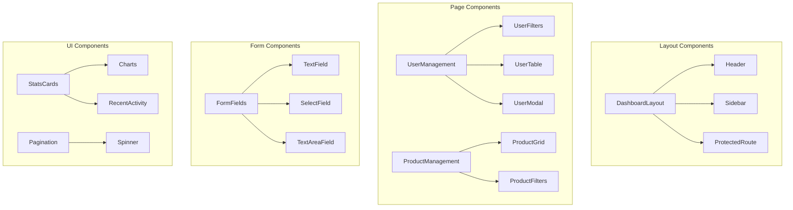
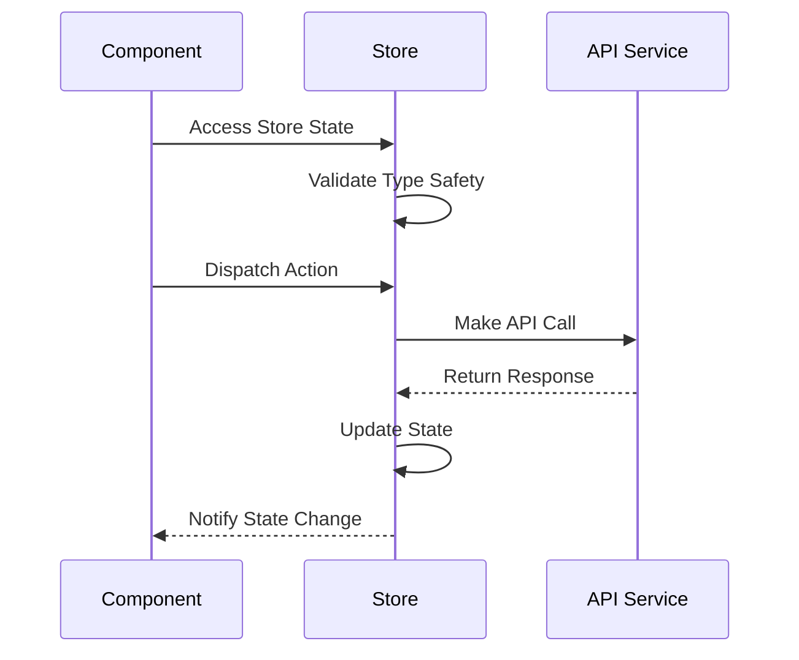
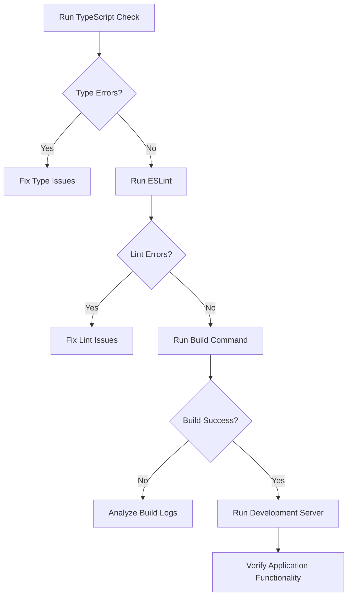

# Dashboard Portfolio - Build Error Analysis & Resolution Design

## Overview

This document outlines a systematic approach to identifying, analyzing, and resolving build-time errors in the Dashboard Portfolio React TypeScript application. The project is a full-featured dashboard application built with modern web technologies including React 19, TypeScript, Vite, Zustand, React Query, and Tailwind CSS.

## Architecture

### Technology Stack Analysis


### Project Structure
```
src/
├── components/
│   ├── forms/           # Form components with validation
│   ├── layout/          # Layout components (Header, Sidebar, etc.)
│   └── ui/              # Reusable UI components
├── hooks/               # Custom React hooks
├── pages/               # Page-level components
├── services/            # API services and client
├── stores/              # Zustand state stores
├── types/               # TypeScript type definitions
├── utils/               # Utility functions
└── router.tsx           # Application routing
```

## Build Error Analysis & Resolution Strategy

### Phase 1: Pre-Build Environment Validation

#### Node.js and Package Dependencies Check


#### Critical Dependencies Verification
| Package | Current Version | Compatibility Notes |
|---------|----------------|-------------------|
| React | ^19.1.1 | Latest major version |
| TypeScript | ^5.9.2 | Compatible with React 19 |
| Vite | ^7.1.2 | Latest version |
| React Router | ^7.9.1 | Latest major version |
| Zustand | ^5.0.8 | Compatible with React 19 |

### Phase 2: TypeScript Configuration Analysis

#### TSConfig Issues Assessment


#### Common TypeScript Build Issues
- **Path Alias Resolution**: Ensure `@/*` paths resolve correctly
- **Type Import/Export Issues**: Missing type imports or circular dependencies
- **React 19 Compatibility**: Updated type definitions for new React features
- **Strict Mode Violations**: Unused parameters, locals, and fallthrough cases

### Phase 3: Import/Export Dependency Analysis

#### Import Resolution Strategy


#### Critical Import Patterns to Validate
- Component imports from `@/components/*`
- Type imports from `@/types/*`
- Service imports from `@/services/*`
- Store imports from `@/stores/*`
- Utility imports from `@/utils/*`

### Phase 4: Component Architecture Validation

#### Component Dependency Graph


#### Component-Specific Error Patterns
- **Missing Props Interface**: Components without proper TypeScript interfaces
- **Hook Dependency Issues**: Incorrect useEffect dependencies
- **State Type Mismatches**: Zustand store type inconsistencies
- **Event Handler Type Errors**: Missing or incorrect event type definitions

### Phase 5: State Management Error Resolution

#### Zustand Store Integration Analysis


#### Store Type Safety Validation
- **authStore**: User authentication state management
- **userStore**: User CRUD operations with pagination
- **productStore**: Product management with filtering
- **uiStore**: UI state persistence with Zustand middleware

### Phase 6: Build Pipeline Optimization

#### Vite Configuration Analysis
```javascript
// Critical Vite Settings for Error Resolution
{
  resolve: {
    alias: {
      '@': resolve(__dirname, './src'),
    },
  },
  esbuild: {
    target: 'es2020',
    logOverride: { 'this-is-undefined-in-esm': 'silent' }
  },
  optimizeDeps: {
    include: ['react', 'react-dom', 'react-router-dom']
  }
}
```

#### Build Error Categories & Solutions

| Error Type | Common Causes | Resolution Strategy |
|------------|---------------|-------------------|
| Module Resolution | Invalid import paths, missing exports | Fix import statements, add missing exports |
| Type Errors | Missing type definitions, incorrect types | Add proper TypeScript interfaces |
| Dependency Issues | Version conflicts, peer dependency warnings | Update package versions, resolve conflicts |
| Asset Loading | Missing assets, incorrect asset paths | Verify asset locations, update references |
| ESLint Violations | Code style issues, unused variables | Fix linting issues, update ESLint config |

### Phase 7: Testing & Validation Framework

#### Post-Fix Validation Process


#### Critical Validation Points
- **TypeScript Compilation**: `npx tsc --noEmit`
- **ESLint Validation**: `npm run lint`
- **Build Process**: `npm run build`
- **Development Server**: `npm run dev`
- **Component Rendering**: Manual verification of key pages

## Implementation Strategy

### Build Error Resolution Workflow

#### Step 1: Environment Setup
1. Verify Node.js version compatibility (>= 18)
2. Clear node_modules and package-lock.json if needed
3. Reinstall dependencies with clean cache
4. Verify package versions for compatibility

#### Step 2: Static Analysis
1. Run TypeScript compiler in check mode
2. Execute ESLint for code quality issues
3. Validate import/export statements
4. Check for circular dependencies

#### Step 3: Build Execution
1. Execute build command with verbose logging
2. Analyze build output for errors
3. Identify and categorize error types
4. Apply targeted fixes based on error category

#### Step 4: Incremental Testing
1. Fix one error category at a time
2. Verify fix doesn't introduce new issues
3. Re-run build process after each fix
4. Document resolution for future reference

### Error Priority Matrix

| Priority | Error Type | Impact | Resolution Complexity |
|----------|------------|--------|----------------------|
| Critical | Module Resolution Failures | High | Medium |
| Critical | TypeScript Type Errors | High | Medium |
| High | Component Import Issues | Medium | Low |
| High | Store Type Mismatches | Medium | Medium |
| Medium | ESLint Violations | Low | Low |
| Low | Asset Path Issues | Low | Low |

## Success Metrics

### Build Health Indicators
- ✅ TypeScript compilation without errors
- ✅ ESLint passes with zero violations
- ✅ Vite build completes successfully
- ✅ Development server starts without issues
- ✅ All critical pages render correctly
- ✅ State management functions properly
- ✅ API integration works as expected

### Performance Benchmarks
- Build time < 30 seconds
- Bundle size optimization
- Hot module replacement functionality
- Type checking performance